# Bootstrap:

## 概念：


## 基础html页面：

```html
<!DOCTYPE html>
<html lang="zh-CN">
  <head>
    <meta charset="utf-8">
    <meta http-equiv="X-UA-Compatible" content="IE=edge">
    <meta name="viewport" content="width=device-width, initial-scale=1">
    <!-- 上述3个meta标签*必须*放在最前面，任何其他内容都*必须*跟随其后！ -->
    <title>Bootstrap 101 Template</title>

    <!-- Bootstrap -->
    <link href="css/bootstrap.min.css" rel="stylesheet">
    <!-- jQuery (Bootstrap 的所有 JavaScript 插件都依赖 jQuery，所以必须放在前边) -->
    <script src="https://cdn.jsdelivr.net/npm/jquery@1.12.4/dist/jquery.min.js"></script>
    <!-- 加载 Bootstrap 的所有 JavaScript 插件。你也可以根据需要只加载单个插件。 -->
    <script src="js/bootstrap.min.js"></script>
  </head>
  <body>
    <h1>你好，世界！</h1>
  </body>
</html>
```

## 响应式布局：


## CSS样式和JS插件：


轮播图是：Carousel

## 案例：


表格实例：

```html
<div class="table-responsive">
    <table class="table table-hover table-bordered table-striped" >
        <caption align="center">学生信息表</caption>
        <thead>
        <tr>
            <th>名称</th>
            <th>城市</th>
            <th>邮编</th>
        </tr>
        </thead>
        <tbody>
        <tr>
            <td>Tanmay</td>
            <td>Bangalore</td>
            <td>560001</td>
        </tr>
        <tr>
            <td>Sachin</td>
            <td>Mumbai</td>
            <td>400003</td>
        </tr>
        <tr>
            <td>Uma</td>
            <td>Pune</td>
            <td>411027</td>
        </tr>
        </tbody>
    </table>
</div>
```


# XML

## 1.概念：


## 2.语法：


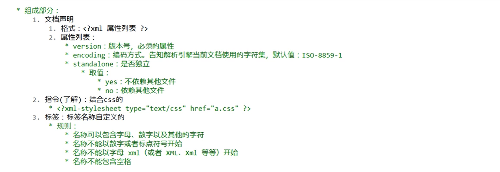

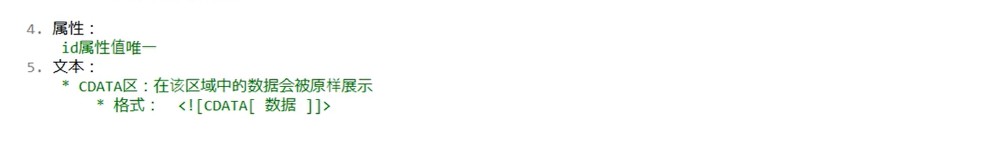


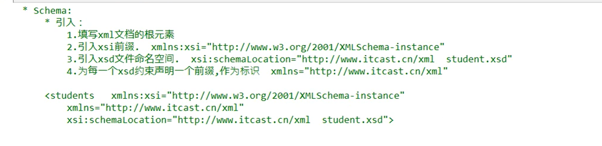

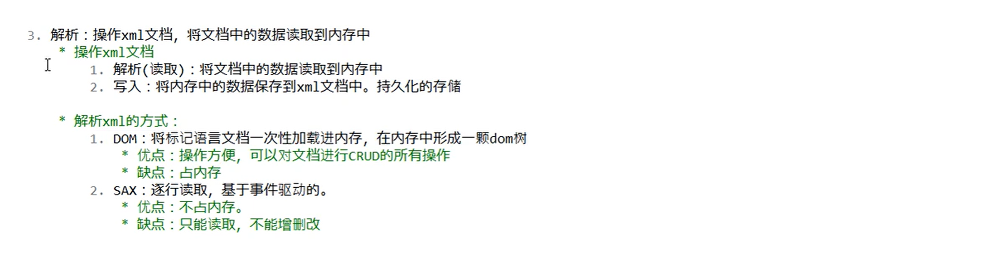

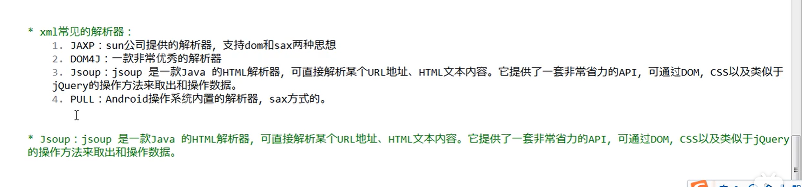

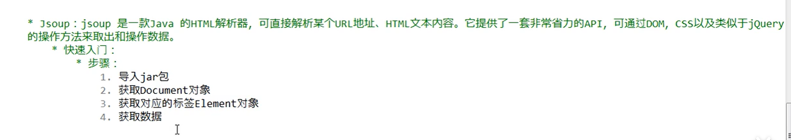

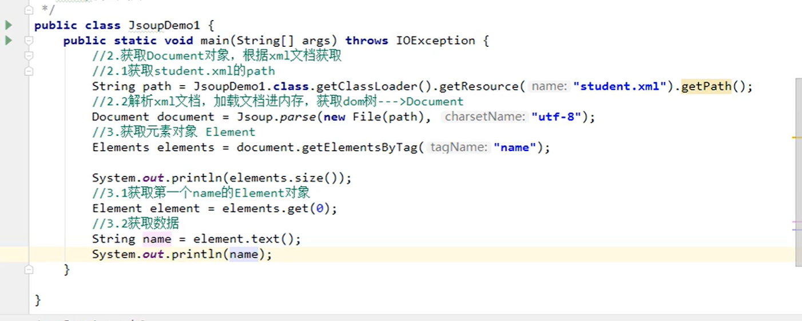

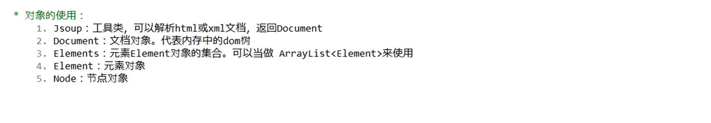

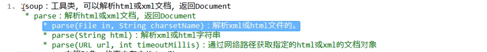

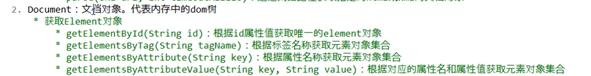

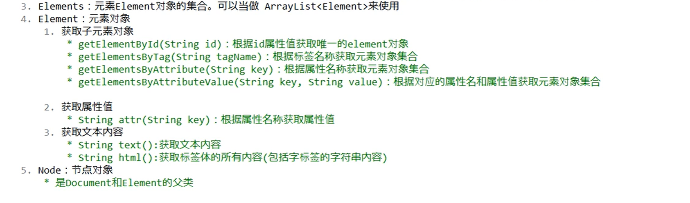

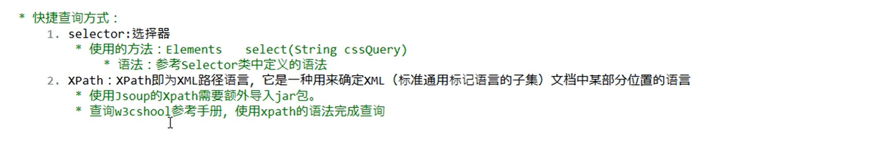