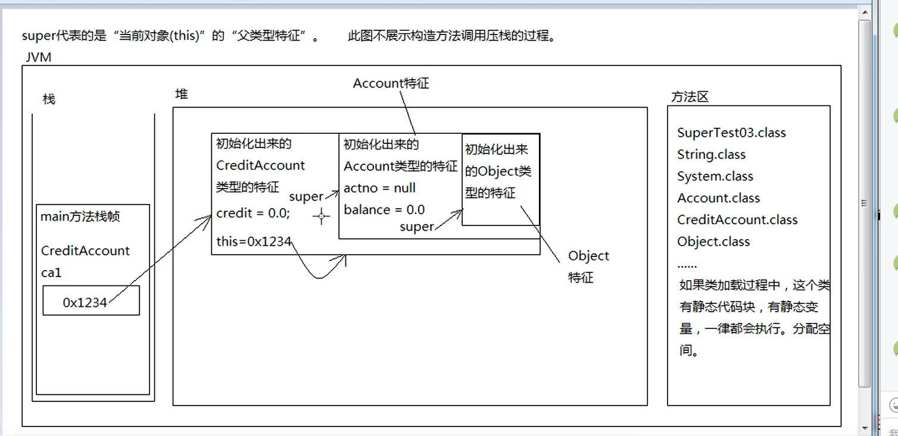
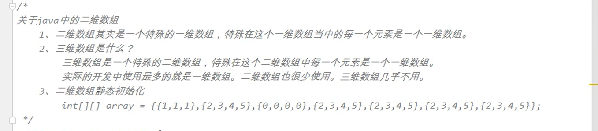
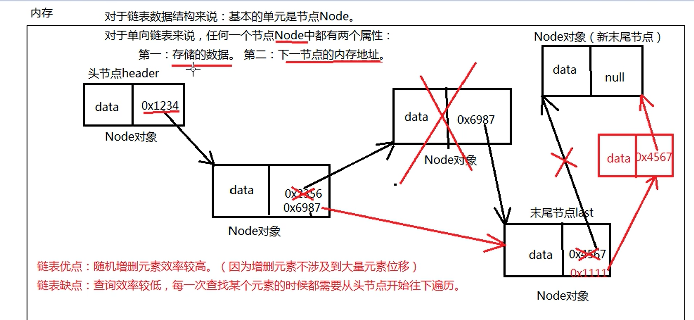
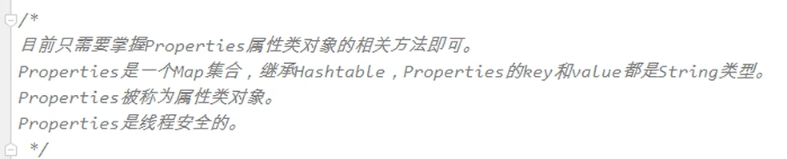
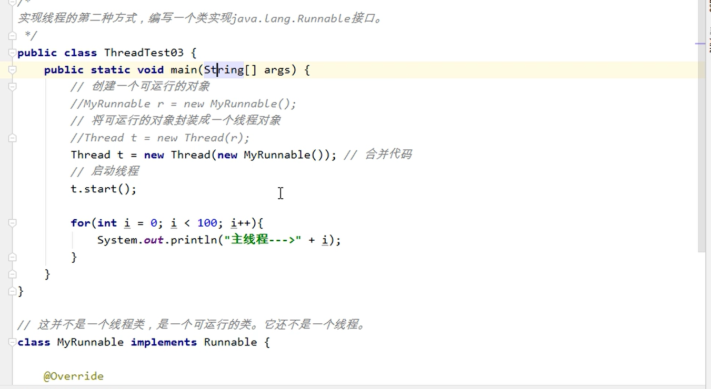

​      

# JAVA

### 1.获取src下文件的绝对路径：


### 2.通过反射灵活创建类的对象：


### 3.ResourceBundle资源绑定器：


### 4.类型转换需要遵循的规则：


### 5.栈数据结构：


### 6.方法执行时的内存变化：


### 7.代码执行顺序：


### 8.实例代码块：


### 9.this的内存结构：


### 10.this的应用：


#### this()的用法：


### 10.1.final


final修饰实例变量的时候：

一般与static连用，static final ...，节省内存空间


#### 常量：


```java
public static final String COUNTRY="中国";
```

### abstract:

抽象类，抽象方法


非抽象类继承抽象类，必须实现父类中的抽象方法，子类可以定义成抽象类，或者将父类的抽象方法重写为普通方法


### interface:

接口


### 11.super():


​	用无参构造方法创建对象时，super的内存结构图：



如果想在子类中访问父类中的变量，可以使用this.name  ,   super.name    ,name  ，此时属性不能被private修饰


super什么时候不能省略：


### 12.一维数组：

#### jvm内存图：


#### 知识点


#### 数组这种数据结构的优缺点：

优点：


缺点：


初始化一维数组：


数组与多态结合：


#### 数组的扩容（拷贝）

System.arraycopy("源数组"，“源数组开始拷贝的下标“，”目标数组“，”拷贝元素个数“）；

### 13.二维数组：



遍历：


另一种写法：（同一维数组写法）


### 14，数组的算法：

#### 冒泡排序：


```java
 public void name2() {
        int[] arr={3,6,2,1,4,8,10};//7个数据要循环6次
        int count=0;
        for (int i = arr.length-1; i >0 ; i--) {//7个数据要对比6次
            System.out.println(i);
            for (int j = 0; j <i; j++) {
                count++;
                if (arr[j]>arr[j+1]){
                    int temp=arr[j];
                    arr[j]=arr[j+1];
                    arr[j+1]=temp;
            }
            }
        }
        System.out.println("count:"+count);
        for (int i = 0; i <arr.length; i++) {
            System.out.print(arr[i]+" ");
        }
    }
```

#### 二分法：

```java
public class dichotomy {

    public static void main(String[] args) {
        int[] arr={10,5,1,2,8,6,4};
        Arrays.sort(arr);
        for (int i = 0; i < arr.length; i++) {
            System.out.print(arr[i]+" ");
        }
        System.out.println();
        int index= dichotomy2(arr,5);
        System.out.println(index==-1? "元素没有获取到":"输入元素的下标为："+index);

    }

    public static int dichotomy2(int[] arr, int i) {
        int begin=0;
        int end=arr.length-1;
        while (begin<=end){
            int min=(begin+end)/2;
            if (arr[min]==i){
                return min;
            }else if (arr[min]<i){
                min=min+1;
            }else {
                min=min-1;
            }
        }
        return -1;
    }
}
```

### 15.Arrays工具类：

sort():数组排序

binarySearch():使用二分法查找元素

# 集合

### 集合概述：


### 集合继承机构图：

#### collection集合


#### Map集合：


### Collection

#### 接口中常用的方法：


#### 集合 遍历/迭代：

对所有的Collection集合都是通用的

```java
Iterator iterator = con.iterator();
while (iterator.hasNext()){
    Object next = iterator.next();
    System.out.print(next+" ");
}
```

#### contains方法：

对于字符串来说，比较的是内容，不是对象的内存地址，底层调用了equals方法（以重写），即使是两个不同的对象，内容相同，其中一个在集合中，集合便包含另一个

注意，若要比较其内容，必须重写equals方法，不重写的比较结果还是false，自定义类可以自己重写equals方法

object类中比较的是对象的内存地址，用的是“==” 


当重写了equals方法后，调用remove方法时，两个不同的对象，内容相同，也会删除

```java
@Test
public void test1() {
    Collection con = new ArrayList();
    String s1 = new String("jack");
    con.add(s1);
    String s2=new String("jack");
    System.out.println("判断两个元素是否相同时："+con.contains(s2));//true
    System.out.println(con.size());//删除前 1
    con.remove(s2);//删除s2,调用equals方法，匹配到集合内有相同的内容，删除了s1
                    //若没有重写equals方法，则 比较 与 删除 失败
    System.out.println(con.size());//0
}
```

结论，放到Collection集合中的对象，要重写equals方法

#### 重写equals步骤：

```java
public boolean equals(Object anObject) {
    if (this == anObject) {
        return true;
    }
    if (anObject==null||!(anObject instanceof student)){
        return false;
    }
    student student1 = (student) anObject;
    if (this.name.equals(student1.name)){//字符串用equals，int类型用“==”
        return true;
    }
    return false;
}
```

#### 关于迭代器的补充：


迭代器的remove方法，是将迭代器生成的“快照”与集合中的元素统一删除

而集合的remove方法只是删除了集合本身的元素，结构发生了改变，迭代器没办法进行比对，所以报异常

### List：


list集特有的方法：（其下的实现类都可以使用）

```java
for (int i = 0; i < list.size(); i++) {
    System.out.print(list.get(i)+" "); //list集合特有的遍历方法，利用get()
}
```

#### Arraylist：


加：Arraylist是非线程安全的

构造方法：

```java
List list1=new ArrayList();//默认容量
List list2=new ArrayList(20);//初始化容量
Collection link= new HashSet();
List lsit4=new ArrayList(link);//参数传入其他集合
```

#### LinkList:

单链表数据结构：



##### 双向链表：

（LinkList采用的是双向链表）

没有初始化容量


#### Vector:

线程安全的


```java
List list=new Vector();
```


#### Collections工具类：

collection集合接口，collections集合工具类，方便对于集合的操作

```java
 public static void main(String[] args) {
       List list=new ArrayList();//非线程安全的
        Collections.synchronizedList(list);//Collections工具类，转换为线程安全的
        list.add(11);
        list.add(33);
        list.add(22);
        Iterator iterator = list.iterator();
        while (iterator.hasNext()){
            System.out.println(iterator.next());
        }
    }
```

Collections.sort()排序方法：

一:Collections对 List 集合排序的时候,必须保证集合中的元素实现了comparable接口，

二：或者使用collention.sort( List集合，构造器对象/匿名内部类)

对Set集合排序的时候，需要先转换为list集合再排序，使用ArrayList的有参构造


### Set:

#### TreeSet:


#### 比较规则：

第一种：

实现Comparable接口，重写compareTo()方法

以下案例是，按照年龄升序排列，年龄相同按照名字降序排序


第二种：

```java
//采用内部类的方式
TreeSet<user> set=new TreeSet<>(new Comparator<user>() {
            @Override
            public int compare(user o1, user o2) {
                return o1.age-o2.age;
            }
        });
//或者实现Comparator接口
class userCom implements Comparator<user>{

    @Override
    public int compare(user o1, user o2) {
        return o1.age-o2.age;
    }
}
```


#### 自平衡二叉树数据结构：


### 泛型：


例子：

```java
public class 泛型测试 {
    public static void main(String[] args) {
        dog dog=new dog();
        cat cat = new cat();
        List<Animal> list=new ArrayList<Animal>();
        list.add(dog);
        list.add(cat);
        Iterator<Animal> iterator = list.iterator();
        //使用公共父类作为泛型，调用子类特有方法，仍然需要向下转型
        while (iterator.hasNext()){
            Animal animal = iterator.next();
            if (animal instanceof dog){
                dog dog1= (dog) animal;
                dog1.shout();
            }
            if (animal instanceof cat){
                cat cat1= (cat) animal;
                cat1.miao();
            }
        }
        
        //使用了公共父类作为泛型，调用公共的方法，不需要强转
       /* while (iterator.hasNext()){
            Animal animal = iterator.next();
            animal.move();
        }*/

       //当不使用泛型时，需要进行强制类型转换
       /* while (iterator.hasNext()){
            Object next = iterator.next();
            if (next instanceof Animal){
                Animal an= (Animal) next;
                an.move();
            }
        }*/

    }
}
class Animal{
    public void move(){
        System.out.println("动物在叫");
    }
}
class dog extends Animal{
    public void shout(){
        System.out.println("汪汪");
    }
}

class cat extends Animal{
    public void miao(){
        System.out.println("喵喵");
    }
}
```

#### 钻石表达式：


#### 自定义泛型：


### 增强for循环（foreach）:


### Map

#### map接口中常用方法：


#### 遍历map集合的几种方式：

一：

```java
 Set<Integer> integers = map.keySet();//要先拿到所有的key
Iterator<Integer> iterator = integers.iterator();
System.out.println("遍历key,通过key拿到对应的value：");
//iterator的方式
while (iterator.hasNext()){
    Integer next = iterator.next();
    String s = map.get(next);
    System.out.print(next+":"+s+" ");
}

//使用foreach的方式
for (Integer integer : integers) {
    System.out.print(integer+":"+map.get(integer)+" ");
}
```

二：

这种写法效率较高，因为是节点对象直接调用方法

```java
System.out.println("========================");
Set<Map.Entry<Integer, String>> entries = map.entrySet();//用map对象直接调用entrySet()
Iterator<Map.Entry<Integer, String>> iterator1 = entries.iterator();
while (iterator1.hasNext()){
    Map.Entry<Integer, String> next = iterator1.next();//此处的next是节点对象
    System.out.println(next.getKey()+"-->"+next.getValue());
}
System.out.println("=========");
for (Map.Entry<Integer, String> entry : entries) {//此处的entry也是节点对象
    System.out.println(entry.getKey()+":"+entry.getValue());
}
```

#### HashMap:


hash:hash值通过哈希函数/算法，可以转换成数组的下标

##### 哈希表数据结构：


重点：放在HashMap集合key部分的元素，以及放在HashSet集合中的元素，需要同时重写HashCode和equals方法


先调用hashcode方法，后调用equals方法，数组下表位置上如果为空，则不会掉用equals


重点：

HashMap集合底层是哈希表数据结构，是非线程安全的，在jdk8之后，如果哈希表单向链表中元素超过8个，单向链表这种数据结构会变成红黑树数据结构，当红黑树上的节点数量小于6时，会重新吧红黑树变成单向链表数据结构

k的哈希值不同，其转换成的数组下标可能相同，产生了哈希碰撞（情况很少）

哈希值相同，其转换的数组下标一定相同

扩容之后的容量是原容量的2倍

注意，hashmap的key和value可以为空，key为空只能有一个，相同的null，值会覆盖， hashtable的key和value不可以为空，为空会报空指针异常

(变成二叉树查找较快，提高效率，前提是元素超过8个)

#### hashtable:


#### properties:



setProperties()方法

getProperties()方法


# 线程

进程和线程的关系


堆和方法区共享，栈独立，其内存结构图为:


对于单核来说，并不是同时执行，只是CPU执行效率很快，人感觉是同时并发执行，但多核CPU可以并发执行

### 创建方式：

##### 一：继承Thread类

使用 引用.start()方式开启线程


开启双线程时：


##### 二.实现Runnable接口：



建议使用第二种方式，面向接口编程，可以继承自定义的类

或者直接：

```java
class test2{
    public static void main(String[] args) {
        Thread thread=new Thread(new Runnable() {	//采用匿名内部类的方式
            public void run() {
                for (int i = 0; i < 100; i++) {
                    System.out.println("之线程-->"+i);
                }

            }
        });
        thread.start();
        for (int i = 0; i < 100; i++) {
            System.out.println("主线程--》"+i);
        }
    }
}
```

### 声明周期：


### 名称：


```java
 Thread thread = Thread.currentThread(); //用于获取当前线程
 System.out.println(thread.getName()); 
//或者直接写成Thread.currentThread().getName();
```

当前线程对象是哪个，Thread.currentThread()指的就是哪个

Thread.currentThread()在方法中被调用时，此时的线程名称为调用此方法的线程名称

### sleep()方法：


```java
class test4{
    //测试sleep方法
    public static void main(String[] args) throws InterruptedException {
        for (int i = 0; i < 10; i++) {
            Thread.sleep(1000);//可以达到间隔一段时间执行代码的效果
            Thread thread = Thread.currentThread();
            thread.setName("sleep测试线程");
            System.out.println(thread.getName()+"--->"+i);
        }
    }
}
```

面试题：注意，sleep（）是静态方法，只需要“类名.sleep()”，与调用它的对象无关，它出现在哪个线程，此线程就会睡眠，

### interrupt()方法：

```java
class interruptTest{
    //线程睡眠中断测试,注意是让线程睡眠中断，并不是让线程终止
    public static void main(String[] args) throws InterruptedException {
        Thread thread = new Thread(new mythread());
        thread.start();
        thread.sleep(1000*5);//让主线程睡5秒
        thread.interrupt();//让分支线程立刻醒来
        System.out.println("主线程执行了！");
    }
}
class mythread implements Runnable{

    public void run() {
        System.out.println(Thread.currentThread().getName()+"--->"+"begin");
        try {
            Thread.sleep(1000*60);//此处只能try--catch，不能throws，
                                    // 因为从父类继承来的方法，不能比父类抛出更多的异常
                                    //非继承来的方法可以
        } catch (InterruptedException e) {
            //捕获异常，并显示在控制台
            e.printStackTrace();
        }
        System.out.println(Thread.currentThread().getName()+"--->"+"end");
    }
}
//运行结果
分支线程执行了-->a
主线程-->执行
分支线程结束-->a
```

### 终止线程：

```java
class 线程的终止{
    public static void main(String[] args) throws InterruptedException {
        mythread4 mythread4 = new mythread4();
        Thread thread=new Thread(mythread4);
        thread.setName("t");
        thread.start();
        thread.sleep(5000);
       // thread.stop();//采用这种方式不安全，容易造成数据的丢失，且已过时不推荐
        mythread4.run=false;//终止线程
    }
}
class mythread4 implements Runnable{
    boolean run=true;
    public void run() {
        for (int i = 0; i < 10; i++) {
            if (run){
                System.out.println(Thread.currentThread().getName()+"-->"+i);
                try {
                    Thread.sleep(1000);
                } catch (InterruptedException e) {
                    e.printStackTrace();
                }
            }else {
                return;
            }

        }

    }
}
```

## 调度（了解）


### 线程的优先级：

#### setPriority()

#### getPriority()

```java
 main.setPriority(1~10);//设置线程的优先级
 getPriority//获取线程的优先级
 Thread.MAX_PRIORITY//最大优先级，10
 		MIN_PRIORITY//最小优先级，1
 		NORM_PRIORITY//默认优先级，5
```

### 线程的让步：

#### Thread.yield()

让位，当前线程暂停，回到就绪状态，让给其他线程

```java
 Thread.yield();//重新进入就绪状态，线程的让步，静态方法
```

### 线程并发下的安全问题（重要）


### synchronized(){}


```java
public void withdraw(double money){
        // double before=this.getMoney();
        // double after=before- money;//取钱后所剩金额
        synchronized (this){
            double after=this.money- money;//取钱后所剩金额
            try {
                Thread.sleep(1000);
            } catch (InterruptedException e) {
                e.printStackTrace();
            }
            //this.setMoney(after);
            this.money=after;
        }

    }
```

另一种写法：


（）中的取值：


null引用会报错，“abc”会使所有的线程都同步(排队)，局部对象变量不可用，全局对象变量可以，找同步线程共享的 对象


如何保证线程安全：


static synchronized 是类锁。

```java
public class 面试题1 {
    public static void main(String[] args) {
        MShi mShi=new MShi();
        MShi mShi2=new MShi();
        Thread thread = new Thread(new MyThread6(mShi));
        Thread thread2 = new Thread(new MyThread6(mShi2));
        thread.setName("t1");
        thread2.setName("t2");
        thread.start();
        try {
            Thread.sleep(2000);
        } catch (InterruptedException e) {
            e.printStackTrace();
        }
        thread2.start();
    }
}

class MyThread6 implements Runnable{

    private MShi mShi;

    public MyThread6(MShi mShi) {
        this.mShi = mShi;
    }

    public void run() {
        if (Thread.currentThread().getName().equals("t1")){
            mShi.doSome();
        }
        if (Thread.currentThread().getName().equals("t2")){
            mShi.doOther();
        }
    }
}

class MShi{
    public static synchronized  void doSome(){
        System.out.println("doSome begin");
        try {
            Thread.sleep(1000*10);
        } catch (InterruptedException e) {
            e.printStackTrace();
        }
        System.out.println("doSome end");
    }

    public static synchronized void doOther(){
        System.out.println("doOther begin");
        System.out.println("doOther end");
    }
}
//共享同一个对象时，doOther没有使用synchronized，不需要等待10秒，原因为它不是同步的，不与需要等待
//两个不同的对象，doOther使用了synchronized，也不需要等待，原因为，共享的对象不同
//static synchronized是类锁，不管创建了几个实例，只要和类有关，都会加锁
```

开发中如何解决线程安全问题：


### 守护线程：

#### thread.setDaemon(true)


```java
thread.setDaemon(true);//设置线程为守护线程，即使是死循环也会终止
```

### 定时器：

spring框架中定时器的底层实现原理

TimerTask是抽象类，不可以直接new

```java
public class 定时器 {
    public static void main(String[] args) throws ParseException {
        Timer timer=new Timer();//
        SimpleDateFormat sdf=new SimpleDateFormat("yyyy-MM-dd HH:mm:ss");
        Date fistTime = sdf.parse("2021-02-16 16:22:00");
        timer.schedule(new TimerTask() {//
            @Override
            public void run() {
                SimpleDateFormat sdf=new SimpleDateFormat("yyyy-MM-dd HH-mm-ss");
                String format = sdf.format(new Date());
                System.out.println(format+"成功执行一次数据备份");
            }
        }, fistTime, 1000 * 5);
    }
}
```

### 实现Callable接口：

这是实现多线程的第三种方式：


```java
/**
 * 实现Callable接口的方式
 * 优点：可以获取线程的返回值
 * 缺点：执行效率较慢，主线程必须等待分支线程执行结束
 */
public class 实现多线程的第三种方式 {
    public static void main(String[] args) throws ExecutionException, InterruptedException {
        //需要给一个Callable接口实现类对象
        FutureTask futureTask=new FutureTask(new Callable() {
            public Object call() throws Exception {//call()方法相当于run方法，只不过带有返回值
                System.out.println("分支线程开始");
                Thread.sleep(3000);
                System.out.println("分线程结束");
                int a=100;
                int b=200;
                return a+b;//自动装箱（300自动变成Integer）
            }
        });

        Thread thread=new Thread(futureTask);
        thread.start();
        Object o = futureTask.get();//get()方法会导致当前线程阻塞
        System.out.println("线程的返回结果为："+o);

        System.out.println("主线程结束！");
    }
}

```

### wait()方法和notify()


### 生产者和消费者模式：


模拟生产者和消费者模式，生产就消费

```java
import java.util.ArrayList;
import java.util.List;

public class 生产者和消费者模式 {
    public static void main(String[] args) {
        List list=new ArrayList();
        Thread thread=new Thread(new mythread3(list));
        Thread thread2=new Thread(new mythread6(list));
        thread.setName("生产者");
        thread2.setName("消费者");
        thread.start();
        thread2.start();
    }
}
//生产者
class mythread3 implements Runnable{
    private List list;

    public mythread3(List list) {
        this.list = list;
    }

    public void run() {
        while (true){
            synchronized (list){
                if (list.size()>0){
                    try {
                        list.wait();
                    } catch (InterruptedException e) {
                        e.printStackTrace();
                    }
                }
                //list=new ArrayList();
                Object o = new Object();
                list.add(o);
                System.out.println(Thread.currentThread().getName()+"-->"+o);
                list.notify();
            }
        }
    }
}
//消费者
class mythread6 implements Runnable{
    private List list;

    public mythread6(List list) {
        this.list = list;
    }

    public void run() {
        while (true){
            synchronized (list){
                if (list.size()==0){
                    try {
                        list.wait();
                    } catch (InterruptedException e) {
                        e.printStackTrace();
                    }
                }
                Object remove = list.remove(0);
                System.out.println(Thread.currentThread().getName()+"-->"+remove);
                list.notify();
            }
        }
    }
}
```