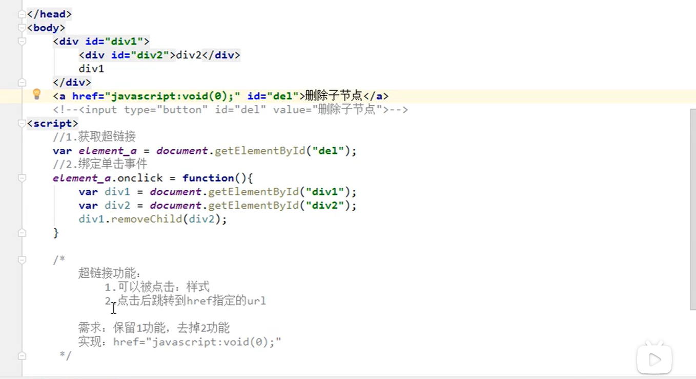

# 										JavaScript

## 对象：

### 对象Function:


## BOM概述：

 

### 开关灯案例：


### window:窗体对象


### Location对象：


### History对象：


### 轮播图案例：


## DOM概述：





## 案例：

表格的一般css样式：


HTML Dom:


## 事件：


### 表单事件：

(两种)


### 表格全选案例：

全选 true，全不选 false，反选 cbs[i].checked=!cbs[i].checked


移动表格行换颜色：


### 表单的验证案例：


# File过滤器

## 1.过滤器配置详解：

1. 具体资源路径：/index.jsp   	只有访问index. jsp资源时，过滤器才会执行
2. 拦截目录 ：/user/ *	访问/user下的所有资源，过滤器都会被执行
3. 后缀名拦截：*.jsp	访问所有后缀名为jsp资源时，过滤器都会被执行
4. 拦截所有资源：/*	访问所有资源时，过滤器都会执行

## 2.拦截方式配置：资源被访问的方式

### 	注解配置：设置dispatcherTypes，多个值用 {  }，中间用逗号隔开:

1. REUQEST:默认值，浏览器直接请求资源

2. FORWARD:转发访问资源

3. INCLUDE：包含访问资源

4. ERROR：错误跳转页面

5. ASYNC:异步访问资源

   ### web.xml配置：

   设置<dispatcher></dispatcher>

## 3.案例

### 判断是否登录，没有登录将会被拦截：

```java
@WebFilter("/*")
public void doFilter(ServletRequest req, ServletResponse resp, FilterChain chain) throws ServletException, IOException {
        HttpServletRequest request=(HttpServletRequest) req;
        String requestURL = request.getRequestURI();
    	//排除掉用户想要登录的界面
        if (requestURL.contains("/login.jsp")||requestURL.contains("/loginServlet")
            ||requestURL.contains("/yanzhengservlet")){
            chain.doFilter(req, resp);
        }else {
            //获取session域中保存的use值
            Object use = request.getSession().getAttribute("use");
            //use不为空，说明用户已登录，直接放行
            if (use!=null){
                chain.doFilter(req, resp);
            }else {
                //没有登录，保存提示信息到request域，并请求转发到登录界面
                request.setAttribute("login_msg","请先登录");
                request.getRequestDispatcher("login.jsp").forward(request,resp);
            }
        }
    }
```

### 关键字的过滤：

```java
@WebFilter("/*")
public class testFilter implements Filter {
    //list集合，保存敏感词汇
    private List<String> list = new ArrayList<String>();

    public void init(FilterConfig config) throws ServletException {
        try {
            //获取文件的真实路径
            ServletContext servletContext = config.getServletContext();
            String realPath = servletContext.getRealPath("/WEB-INF/classes/敏感词汇");
	       
            BufferedReader read = new BufferedReader(new FileReader(realPath));
            String str = null;
            //读取
            while ((str = read.readLine()) != null) {
                list.add(str);
            }
            //关闭流
            read.close();
            System.out.println(list);
        } catch (Exception e) {
            e.printStackTrace();
        }
    }

    public void doFilter(ServletRequest req, ServletResponse resp, FilterChain chain) throws ServletException, IOException {
        /**
        三个参数：
        	1.类加载器：真实对象.getClass().getClassLoader()
        	2.接口数组：真实对象.getClass().getInterfaces(),真实对象和代理对象实现的时同一个接口
        	3.处理器： new InvocationHandler() 固定的写法
        **/
         //proxy_req，代理对象
        ServletRequest proxy_req = (ServletRequest) Proxy.newProxyInstance(req.getClass().getClassLoader(), 				req.getClass().getInterfaces(), new InvocationHandler() {
            /**
            代理对象调用的所有方法，都会触发该方法的执行
            三个参数：
            	1：proxy，代理对象
            	2：method，代理对象调用的方法，被封装为的对象
            	3:args，代理对象调用方法时，传递的实际参数
            **/
            @Override
            public Object invoke(Object proxy, Method method, Object[] args) throws Throwable {
             //增强getParameter方法
			//如果是"getParameter"方法，就进行关键字审查并替换
                if (method.getName().equals("getParameter")) {
                  //增强返回值
				//获取返回值
                    String value = (String) method.invoke(req, args);
                    if (value != null) {
                        for (String s : list) {
                            if (value.contains(s)) {
                                value = value.replaceAll(s, "***");
                            }
                        }
                    }
				//返回被修改后的值
                    return value;

                } else {
                    //若不是getParameter方法，原样返回
                    return method.invoke(req, args);
                }

            }
        });
        //放行！！注意传递的参数是"代理对象"
        chain.doFilter(proxy_req, resp);

    }

```

# 	                                          Lintener监听器

## 知识点：


## Session:


