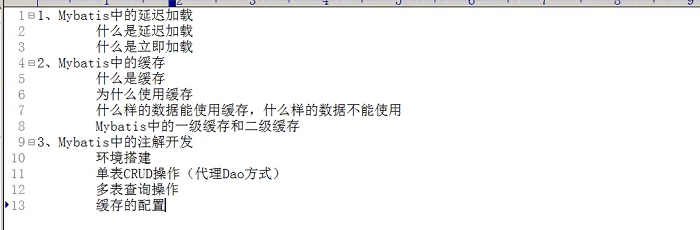

# Mybatis

## 一:标签的使用及详解：

实体类的属性和数据库的列名不匹配解决方案：

### resultMap标签：

```xml
<!--配置 查询结果的列名和实体类的属性名的对应关系-->
    <resultMap id="userMap" type="zbvc.domain.User">
        <!--主键字段的对应-->
        <id property="uid" column="id"></id>
        <!--非主键字段的对应-->
        <result property="userName" column="username"></result>
        <result property="userAddress" column="address"></result>
        <result property="userBirthday" column="birthday"></result>
    </resultMap>
<!--使用 resultMap -->
 <select id="finAll"  resultMap="userMap">
        select *from user2
    </select>
```

### properties标签(main)：

#### 使用resource:


#### 使用url:


###  typeAliases标签(main):

```xml
<!--配置参数的别名（parameterType）-->
<typeAliases>
        <!--typeAlias属性用于配置别名，type指定的是实体类全限定类名，alias指定别名，此时不再区分大小写-->
        <!--<typeAlias type="zbvc.domain.User" alias="user"></typeAlias>-->
        <!--用于指定要配置别名的包，当指定之后，其包下的所有实体类都会注册别名，并且别名就是类名，不区分大小写-->
        <package name="zbvc.domain"/>
    </typeAliases>
使用：
 <update id="UpdateUser" parameterType="User">
```

## 二：连接池：


POOLED的内部执行原理图：


```java
 sqlSession = factory.openSession(true);//设置事务提交的方式为自动提交
```

## 动态Sql语句：

### if语句：

```xml
 <select id="FindUserByCondition" resultType="zbvc.domain.User" parameterType="user">
        select *from user2 where 1=1
        <if test="username!=null">
            and username like #{username}
        </if>
    </select>
```

### where标签：

```xml
 <select id="FindUserByCondition" resultType="zbvc.domain.User" parameterType="user">
        select *from user2
        <where>
        <if test="username!=null">
            and username like #{username}
        </if>
        </where>
    </select>
```

## 三：多表查询：

### 定义新的resultMap：

private User user;

```xml
 <resultMap id="resultMapAccount" type="account">
     
        <id property="id" column="id"></id>
        <result property="uid" column="uid"></result>
        <result property="money" column="money"></result>
     
        <association property="user" column="uid" javaType="user">
            <id property="id" column="id"></id>
            <result property="username" column="username"></result>
            <result property="address" column="address"></result>
            <result property="birthday" column="birthday"></result>
        </association>

    </resultMap>
```

```xml
  <select id="findAccount" resultMap="resultMapAccount">
        select a.*,u.username,u.address ,u.birthday from user2 u,account a where u.id=a.uid
    </select>
```

private List<account> account;

一对多的情况：

```xml
  <resultMap id="resultMapAccount" type="user">
        <id property="id" column="id"></id>
        <result property="address" column="address"></result>
        <result property="username" column="username"></result>
        <result property="birthday" column="birthday"></result>
        <collection property="account" ofType="account">
            <id property="id" column="id"></id>
            <result property="udi" column="uid"></result>
            <result property="money" column="money"></result>
        </collection>
    </resultMap>

    <!--resultType返回值的类型-->
    <select id="finAll" resultMap="resultMapAccount">
        SELECT u.*,a.money FROM user2 u LEFT JOIN account a ON u.id=a.uid;
    </select>
```

## 四：延迟加载




### configuration的内容匹配顺序：

```
元素类型为 "configuration" 的内容必须匹配 "(properties?,settings?,typeAliases?,typeHandlers?,objectFactory?,objectWrapperFactory?,reflectorFactory?,plugins?,environments?,databaseIdProvider?,mappers?)"。
```

### 支持延迟加载的settings配置：

```xml
<settings>
        <setting name="lazyLoadingEnabled" value="true"/>
        <setting name="aggressiveLazyLoading" value="false"/>
    </settings>
```

一对一，多对一：

```xml
<resultMap id="resultMapAccount" type="account">
    <id property="id" column="id"></id>
    <result property="uid" column="uid"></result>
    <result property="money" column="money"></result>
    
	<association property="user" column="uid" javaType="user" select="zbvc.dao.Userdao.findById"></association>
</resultMap>

 <select id="finAll" resultMap="resultMapAccount">
        select *from account
    </select>
```

```xml
<select id="findById" resultType="user" parameterType="int">
        select *from user2 where id=#{uid}
    </select>
```

一对多：

```xml
<resultMap id="resultMapAccount" type="user">
        <id property="id" column="id"></id>
        <result property="address" column="address"></result>
        <result property="username" column="username"></result>
        <result property="birthday" column="birthday"></result>
        <collection property="account" ofType="account" select="zbvc.dao.IAccount.findAccountByUid" column="id">
        </collection>
    </resultMap>

    <!--resultType返回值的类型-->
    <select id="finAll" resultMap="resultMapAccount">
        SELECT * FROM user2
    </select>
```

```xml
 <select id="findAccountByUid" parameterType="int" resultType="account">
        select *from account where uid=#{id}
    </select>
```

## 五：缓存

### 一级缓存：


```java
 sqlSession.clearCache();//清空sqlSession里的缓存
```

```java
User byId = Dao.findById(3);
System.out.println(byId);

sqlSession.clearCache();

User byId2=Dao.findById(3);
System.out.println(byId2);

System.out.println(byId==byId2);
```


### 二级缓存：


```java
@Test
    public void testFindById(){
        SqlSession sqlSession = factory.openSession();
        Userdao mapper = sqlSession.getMapper(Userdao.class);
        User byId = mapper.findById(3);
        System.out.println(byId);
        sqlSession.close();//一级缓存消失

        SqlSession sqlSession2= factory.openSession();
        Userdao mapper2= sqlSession2.getMapper(Userdao.class);
        User byId2 = mapper2.findById(3);
        System.out.println(byId2);
        sqlSession2.close();

        System.out.println(byId==byId2);
    }
```

```xml
 <setting name="cacheEnabled" value="true"/> //默认开启
```

```xml
 <cache></cache>

 <!--useCache:使用二级缓存-->
<select id="findById" resultType="user" parameterType="int" useCache="true">
```


## 六：注解开发

### 成员变量名与数据表属性名不相同：

```java
 @Select("select *from user2 ")
 @Results(id="userMap", value ={
     @Result(id = true,property = "Id",column = "id"),
     @Result(property = "Username",column = "username"),
     @Result(property = "Address",column = "address"),
     @Result(property = "Birthday",column = "birthday")
   })
List<User> finAll();

//重复使用
@Select("select *from user2 where username like #{username}")
@ResultMap(value =("userMap")) //也可直接写(userMap)
List<User> FindUserByName(String name);
```

### 一对一（多对一）

返回值是一个对象：

```java
Accountdao:
@Select("select *from account")
    @Results(id="AccountMap",value = {
            @Result(id = true,property = "id" ,column ="id"),
            @Result(property = "uid",column = "uid"),
            @Result(property = "money",column = "money"),
            @Result(property = "user",column = "uid",one =@One(select = "zbvc.dao.Userdao.FindUserById",
                    fetchType = FetchType.EAGER ))
    })
    List<Account> findAll();

Userdao:
 @Select("select *from user2 where id=#{uid}")
    @ResultMap("userMap")
    User FindUserById(Integer uid);
```

### 一对多：

返回值是一个List集合：

```java
Userdao:
@Select("select *from user2 ")
    @Results(id="userMap", value ={
            @Result(id = true,property = "Id",column = "id"),
            @Result(property = "Username",column = "username"),
            @Result(property = "Address",column = "address"),
            @Result(property = "Birthday",column = "birthday"),
            @Result(property = "accounts",column = "id" ,many = @Many(select = "zbvc.dao.IAccount.findById",
                    fetchType = FetchType.LAZY))
    })
    List<User> finAll();
Account:
 @Select("select *from account where uid=#{id}")
    List<Account> findById(Integer id);
```

### 一级缓存：

默认实现

### 二级缓存：

```
SqlSession sqlSession = factory.openSession();
        Userdao dao = sqlSession.getMapper(Userdao.class);
        User user = dao.FindUserById(6);
        System.out.println(user);
        sqlSession.close();

        SqlSession sqlSession2=factory.openSession();
        Userdao dao2 = sqlSession2.getMapper(Userdao.class);
        User user1 = dao2.FindUserById(6);
        System.out.println(user1);
        System.out.println(user==user1);
        sqlSession.close();
```

Userdao:

```java
@CacheNamespace(blocking = true)
```

