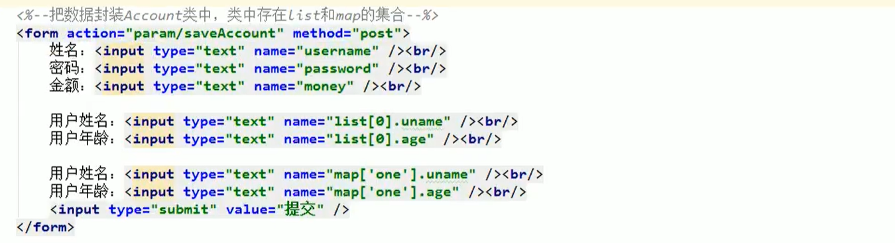
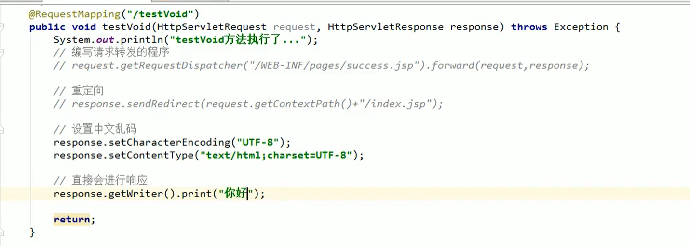
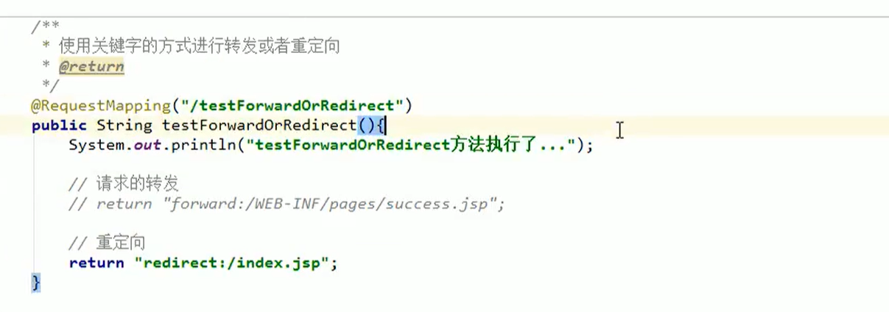
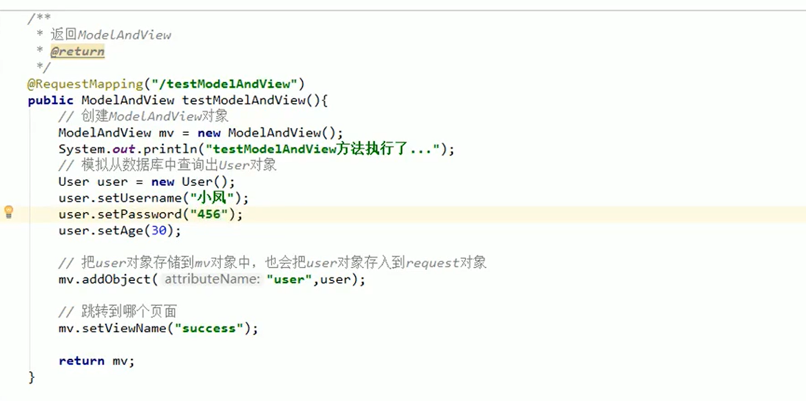
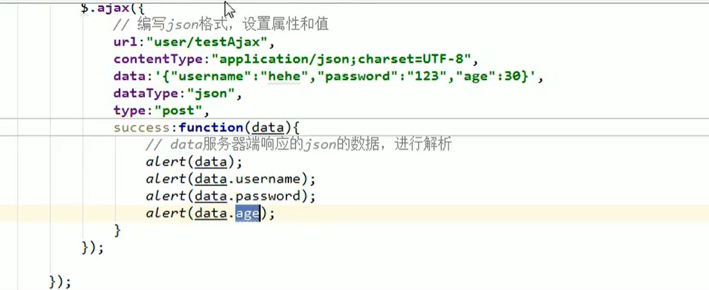
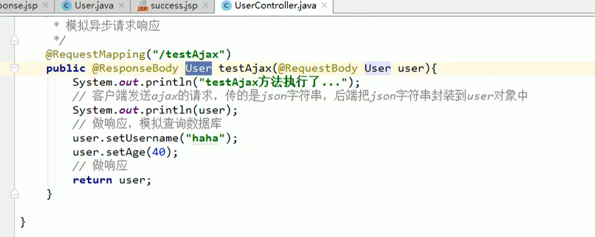

## SpringMVC

### 1.导入依赖：

```xml
<?xml version="1.0" encoding="UTF-8"?>
<project xmlns="http://maven.apache.org/POM/4.0.0"
         xmlns:xsi="http://www.w3.org/2001/XMLSchema-instance"
         xsi:schemaLocation="http://maven.apache.org/POM/4.0.0 http://maven.apache.org/xsd/maven-4.0.0.xsd">
    <modelVersion>4.0.0</modelVersion>

    <groupId>org.example</groupId>
    <artifactId>ssmbuild</artifactId>
    <version>1.0-SNAPSHOT</version>
    <dependencies>
        <!--Junit-->
        <dependency>
            <groupId>junit</groupId>
            <artifactId>junit</artifactId>
            <version>4.12</version>
        </dependency>
        <!--数据库驱动-->
        <dependency>
            <groupId>mysql</groupId>
            <artifactId>mysql-connector-java</artifactId>
            <version>5.1.47</version>
        </dependency>
        <!-- 数据库连接池 -->
        <dependency>
            <groupId>com.mchange</groupId>
            <artifactId>c3p0</artifactId>
            <version>0.9.5.2</version>
        </dependency>
        <!--lombok-->
        <dependency>
            <groupId>org.projectlombok</groupId>
            <artifactId>lombok</artifactId>
            <version>1.16.10</version>
            <scope>provided</scope>
        </dependency>
        <!--Servlet - JSP -->
        <dependency>
            <groupId>javax.servlet</groupId>
            <artifactId>servlet-api</artifactId>
            <version>2.5</version>
        </dependency>
        <dependency>
            <groupId>javax.servlet.jsp</groupId>
            <artifactId>jsp-api</artifactId>
            <version>2.2</version>
        </dependency>
        <dependency>
            <groupId>javax.servlet</groupId>
            <artifactId>jstl</artifactId>
            <version>1.2</version>
        </dependency>

        <!--Mybatis-->
        <dependency>
            <groupId>org.mybatis</groupId>
            <artifactId>mybatis</artifactId>
            <version>3.5.2</version>
        </dependency>
        <dependency>
            <groupId>org.mybatis</groupId>
            <artifactId>mybatis-spring</artifactId>
            <version>2.0.2</version>
        </dependency>
        <!--织入包-->
        <dependency>
            <groupId>org.aspectj</groupId>
            <artifactId>aspectjweaver</artifactId>
            <version>1.8.13</version>
        </dependency>
        <!--Spring-->
        <dependency>
            <groupId>org.springframework</groupId>
            <artifactId>spring-webmvc</artifactId>
            <version>5.1.9.RELEASE</version>
        </dependency>
        <dependency>
            <groupId>org.springframework</groupId>
            <artifactId>spring-jdbc</artifactId>
            <version>5.1.9.RELEASE</version>
        </dependency>
    </dependencies>

    <!--maven资源过滤设置-->
    <build>
        <resources>
            <resource>
                <directory>src/main/java</directory>
                <includes>
                    <include>**/*.properties</include>
                    <include>**/*.xml</include>
                </includes>
                <filtering>true</filtering>
            </resource>
        </resources>
    </build>

</project>
```


### 2.请求参数绑定：

user   list    map   




### 3.自定义类型转换器（date）

```java
//controller层  
@RequestMapping("/u1")
    public String u1(User user, Model model){
        System.out.println("user="+user);
        model.addAttribute("user",user);
        return "success";
        //结果 User{name='小亮', password='123', birthday=Wed Feb 03 00:00:00 CST 2021}
    }

//工具类 StringToDate
public class StringToDate implements Converter<String, Date> {
    @Override
    public Date convert(String s) {
        System.out.println("StringToDate执行了！");
        if (s==null){
            throw new  RuntimeException("未输入相关参数");
        }
        SimpleDateFormat simpleDateFormat=new SimpleDateFormat("yyyy-MM-dd");
        try {
            return simpleDateFormat.parse(s);
        } catch (ParseException e) {
          e.printStackTrace();
        }
        return new Date();
    }
}


```

```xml
 <!--转换器-->
    <bean id="conversionServiceFactory"
          class="org.springframework.context.support.ConversionServiceFactoryBean">
        <property name="converters">
            <set>
                <bean class="com.zbvc.until.StringToDate"></bean>
            </set>
        </property>
    </bean>

    <mvc:annotation-driven conversion-service="conversionServiceFactory"/>

```

### 4.spring-ajax;

```html
<script>
    $(function () {
            $("#name").blur(function () {
                $.post(
                    "${pageContext.request.contextPath}/user/login",
                    {"name":$("#name").val()},
                    function (data) {
                        console.log(data);
                        if (data.flag==true){
                            $("#sname").text(data.msg);
                            $("#sname").color("green")
                        }else {
                            $("#sname").text(data.msg)
                        }
                    }
                );
            });

        });
</script>
 
<form action="${pageContext.request.contextPath}/user/Tlogin">
    用户名：<input type="text" id="name" name="name" ><span id="sname"></span><br>
    密码：<input type="password" id="pwd" name="pwd" onblur="pwd()"><span id="spwd"></span>
    <input type="submit" value="提交">
</form>
```

```java
 @RequestMapping("/resume")
    @ResponseBody
    public List<User> test2(){
        List<User> userList=new ArrayList<User>();
        userList.add(new User(1,"小董",12));
        userList.add(new User(2,"小明",14));
        userList.add(new User(3,"小方",15));
        return userList;
    }
```


### 5.拦截器：

```xml
 <!--拦截器-->
    <mvc:interceptors>
        <mvc:interceptor>
            <mvc:mapping path="/user/**"/>
            <bean class="com.zbvc.until.MyInterceptor"/>
        </mvc:interceptor>
    </mvc:interceptors>
```

```java
public class MyInterceptor implements HandlerInterceptor {
    //执行前
    public boolean preHandle(HttpServletRequest request, HttpServletResponse response, Object handler) throws Exception {
        //用户去登陆
        if (request.getRequestURI().contains("goLogin")||request.getRequestURI().contains("Tlogin")){
            return true;
        }
        HttpSession session = request.getSession();
        if (session.getAttribute("user")!=null){
            return true;
        }
        request.getRequestDispatcher("/WEB-INF/jsp/login.jsp").forward(request,response);
        return false;
    }
    //执行后
    public void postHandle(HttpServletRequest request, HttpServletResponse response, Object handler, ModelAndView modelAndView) throws Exception {

    }
    //清理机制
    public void afterCompletion(HttpServletRequest request, HttpServletResponse response, Object handler, Exception ex) throws Exception {

    }
}
```


### 6.文件的上传和下载：

```java
@RestController
public class File1 {
    //@RequestParam("file") 将name=file控件得到的文件封装成CommonsMultipartFile 对象
    //批量上传CommonsMultipartFile则为数组即可
    @RequestMapping("/upload")
    public String fileUpload(@RequestParam("file") CommonsMultipartFile file , HttpServletRequest request) throws
    IOException {

        //获取文件名 : file.getOriginalFilename();
        String uploadFileName = file.getOriginalFilename();

        //如果文件名为空，直接回到首页！
        if ("".equals(uploadFileName)){
            return "redirect:/index.jsp";
        }
        System.out.println("上传文件名 : "+uploadFileName);

        //上传路径保存设置
        String path = request.getServletContext().getRealPath("/upload");
        //如果路径不存在，创建一个
        File realPath = new File(path);
        if (!realPath.exists()){
            realPath.mkdir();
        }
        System.out.println("上传文件保存地址："+realPath);

        InputStream is = file.getInputStream(); //文件输入流
        OutputStream os = new FileOutputStream(new File(realPath,uploadFileName)); //文件输出流

        //读取写出
        int len=0;
        byte[] buffer = new byte[1024];
        while ((len=is.read(buffer))!=-1){
            os.write(buffer,0,len);
            os.flush();
        }
        os.close();
        is.close();
        return "redirect:/index.jsp";
    }
    /*
     * 采用file.Transto 来保存上传的文件
     */
    @RequestMapping("/upload2")
    public String  fileUpload2(@RequestParam("file") CommonsMultipartFile file, HttpServletRequest request) throws IOException {

        //上传路径保存设置
        String path = request.getServletContext().getRealPath("/upload");
        //String realPath = getServletContext().getRealPath("/applicant/images");
        File realPath = new File(path);
        if (!realPath.exists()){
            realPath.mkdir();
        }
        //上传文件地址
        System.out.println("上传文件保存地址："+realPath);
        System.out.println("文件名:"+file.getOriginalFilename());
        //通过CommonsMultipartFile的方法直接写文件（注意这个时候）
        file.transferTo(new File(realPath +"/"+ file.getOriginalFilename()));

        return "redirect:/index.jsp";
    }

    @RequestMapping(value="/download")
    public String downloads(HttpServletResponse response , HttpServletRequest request) throws Exception{
        //要下载的图片地址
        String  path = request.getServletContext().getRealPath("/upload");
        String  fileName = "1.jpg";

        //1、设置response 响应头
        response.reset(); //设置页面不缓存,清空buffer
        response.setCharacterEncoding("UTF-8"); //字符编码
        response.setContentType("multipart/form-data"); //二进制传输数据
        //设置响应头
        response.setHeader("Content-Disposition",
                "attachment;fileName="+ URLEncoder.encode(fileName, "UTF-8"));

        File file = new File(path,fileName);
        //2、 读取文件--输入流
        InputStream input=new FileInputStream(file);
        //3、 写出文件--输出流
        OutputStream out = response.getOutputStream();

        byte[] buff =new byte[1024];
        int index=0;
        //4、执行 写出操作
        while((index= input.read(buff))!= -1){
            out.write(buff, 0, index);
            out.flush();
        }
        out.close();
        input.close();
        return null;
    }
}
```

```xml
 <!--文件上传配置-->
    <bean id="multipartResolver"  class="org.springframework.web.multipart.commons.CommonsMultipartResolver">
        <!-- 请求的编码格式，必须和jSP的pageEncoding属性一致，以便正确读取表单的内容，默认为ISO-8859-1 -->
        <property name="defaultEncoding" value="utf-8"/>
        <!-- 上传文件大小上限，单位为字节（10485760=10M） -->
        <property name="maxUploadSize" value="10485760"/>
        <property name="maxInMemorySize" value="40960"/>
    </bean>
```

```xml
  <!--文件上传-->
        <dependency>
            <groupId>commons-fileupload</groupId>
            <artifactId>commons-fileupload</artifactId>
            <version>1.3.3</version>
        </dependency>
        <!--servlet-api导入高版本的-->
        <dependency>
            <groupId>javax.servlet</groupId>
            <artifactId>javax.servlet-api</artifactId>
            <version>4.0.1</version>
        </dependency>
```

### 7.常见的注解：

#### RequestParam

```java
@RequestMapping("/test")//传递的参数名和接收名不同时
public String test(@RequestParam(name = "name") String username){
    
```

#### PathVariable

```java
@RequestMapping("/test/{uid}")//使用restfule风格时
public String test(@PathVariable(name = "uid") int id){

```

```html
<a href="${pageContext.request.contextPath}/book/test/10">PathVariable的使用</a>
```

#### RequestHeader:

​		获取请求头的值。

#### CookieValue：

```java
//获取指定CookieValue的值
public String test(@CookieValue(value = "JSESSIONID") int id){
```

#### ModelAttribute：

```java
@RequestMapping("/test1")
public void test1(Books books){
    System.out.println(books.toString());
}

@ModelAttribute
public Books bookCounts(int bookID){
    System.out.println("执行了！！");
    Books books=new Books();
    //用户输入的值 会覆盖 数据库的值
    books.setBookID(bookID);
    books.setBookName("python");
    books.setBookCounts(20);
    //用户未输入的，将由 数据库 的值所 补充
    books.setDetail("这是一本好书!");
    return books;
}
```

```html
<form action="${pageContext.request.contextPath}/test1" method="post">
    
	<%--用户输入的值并不全面，此时可以选择使用后台数据库中的值进行补充--%>
    书ID: <input type="text" name="bookID" ><br>
    书名: <input type="text" name="bookName" ><br>
    数量: <input type="text" name="bookCounts" ><br>

    <input type="submit" value="提交" >

</form>
```


#### SessionAttributes：

```java
@Controller
@SessionAttributes(value = "msg")//使用此注解，可以把request域里特定的数据存入到session域里
public class test {

@RequestMapping("/test2")
public String test2(Model model){
    model.addAttribute("msg","--小董--");
    return "test2";
}

@RequestMapping("/test3")
public String test3(ModelMap model){
    String msg = (String) model.get("msg");
    System.out.println("从session域中获取到的数据为："+msg);
    return "redirect:/test4";//重定向
}

@RequestMapping("/test4")
public String test3(SessionStatus status//此处使用){
    status.setComplete();//可以清空session里的数据
    System.out.println("===数据以清空！===");
    return "test2";
}
```

### 8.使用servletAPI进行转发或重定向：



### 9.使用forword和redirect进行请求转发和重定向



### 10.返回值是ModelAndView：




### 11.ajax





### 12.异常的处理

```java
@Controller
public class c_exception {

    @RequestMapping("/e")
        public String testException(Model model) throws SysException {
        double i;
        try {
            i=20/3;
        } catch (Exception e) {
            e.printStackTrace();
            throw new SysException("程序出现异常！");
        }
        model.addAttribute("result",i);
        return "sucess";
    }
}
```

```java
package com.zbvc.exception;
//自定义异常类
public class SysException extends Exception{

    private String errorMsg;

    public SysException(String errorMsg) {
        this.errorMsg = errorMsg;
    }

    public String getErrorMsg() {
        return errorMsg;
    }

    public void setErrorMsg(String errorMsg) {
        this.errorMsg = errorMsg;
    }
}

```

```java
//异常处理器
public class SystemExceptionTese implements HandlerExceptionResolver {
    @Override
    public ModelAndView resolveException(HttpServletRequest httpServletRequest, HttpServletResponse httpServletResponse, Object o, Exception e) {
        SysException sysException=null;
        if (e instanceof SysException){
            sysException= (SysException) e;
        }else {
            new SysException("系统出现异常！");
        }
        ModelAndView mav=new ModelAndView();
        mav.addObject("errorMsg",sysException.getErrorMsg());
        mav.setViewName("error");
        return mav;
    }
}
```

spring-mvc:

```xml
<!--配置异常处理器-->
<bean id="systemExceptionTese" class="com.zbvc.exception.SystemExceptionTese"></bean>
```

