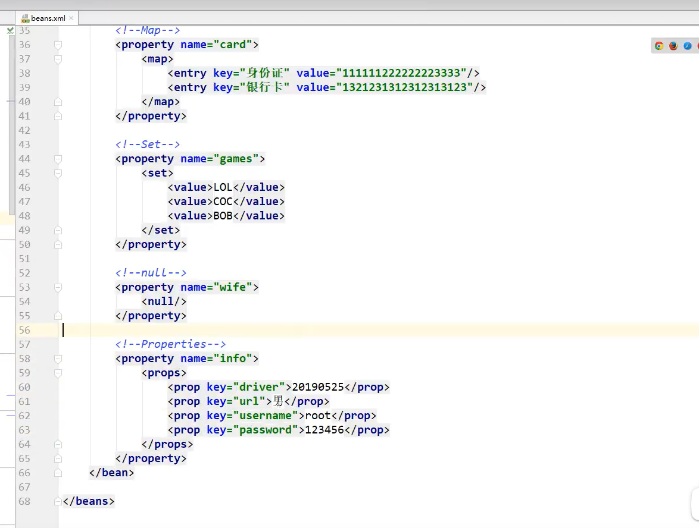
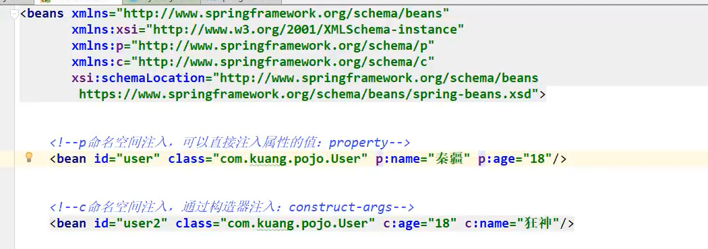

# spring

## 一：IOC的概念和作用：


### 使用xml文件配置bean：

```xml
<?xml version="1.0" encoding="UTF-8"?>
<beans xmlns="http://www.springframework.org/schema/beans"
       xmlns:xsi="http://www.w3.org/2001/XMLSchema-instance"
       xsi:schemaLocation="http://www.springframework.org/schema/beans
        http://www.springframework.org/schema/beans/spring-beans.xsd">

    <bean id="Factorytest" class="zbvc.factory.Factorytest"></bean>
    <!-- collaborators and configuration for this bean go here -->
    <!-- 纯注解时这里就相当于@Configuration  -->
</beans>
```

```xml
<!-- springIOC所需依赖  -->
<dependency>
            <groupId>org.springframework</groupId>
            <artifactId>spring-context</artifactId>
            <version>5.0.2.RELEASE</version>
        </dependency>
```

```java
public static void main(String[] args) {
        //获取核心容器对象
        ApplicationContext a=new ClassPathXmlApplicationContext("bean.xml");
        //获取bean对象
        Factorytest test= (Factorytest) a.getBean("Factorytest");
        System.out.println(test);
        test.connection();
    }
```


### 使用工厂创建对象的多种方式：

类中的方法。类中的静态方法


### bean的作用范围调整：


#### global-session:


### bean的生命周期：

#### 单例对象：


#### 多例对象：


## spring中的依赖注入：


#### 构造函数注入：


#### set方式注入：


#### 注入集合数据：




拓展的注入方式：



## 二：使用注解方式实现IOC:

### 用于创建对象的：

Component:普通的

Controller：表现层

Service：业务层

Repository：持久层

```xml
<?xml version="1.0" encoding="UTF-8"?>
<beans xmlns="http://www.springframework.org/schema/beans"
       xmlns:xsi="http://www.w3.org/2001/XMLSchema-instance"
       xmlns:context="http://www.springframework.org/schema/context"
       xsi:schemaLocation="http://www.springframework.org/schema/beans
        http://www.springframework.org/schema/beans/spring-beans.xsd
        http://www.springframework.org/schema/context
        http://www.springframework.org/schema/context/spring-context.xsd">
    <!--使用xml配置的方式-->
    <!--<bean id="Factorytest" class="zbvc.factory.Factorytest"></bean>-->
    <!--使用注解配置-->
    <context:component-scan base-package="zbvc"></context:component-scan>
    <!-- collaborators and configuration for this bean go here -->
    <!-- 纯注解时这里就相当于@Configuration  -->
</beans>
```

```java
@Component(value="name")//或者省略value
```


### 用于注入数据的：

Autowired:自动按照类型注入

Qualifier:按照类的基础上再按照名称注入，不可单独使用

Resource:直接按照bean的id注入，可以独立使用

以上三种只能注入其他bean类型

value;用于注入基本类型和string类型


### 该变作用范围和声明周期：


### 使用注解代替xml：

Configuration:指定当前类是一个配置类

componentScan:指定创建容器时要扫描的包

Bean:把当前方法的返回值作为bean对象存入spring的ioc容器中

Import:导入其他的配置类

使用xml的方式:


三：spring整合junit

为什么整合？


